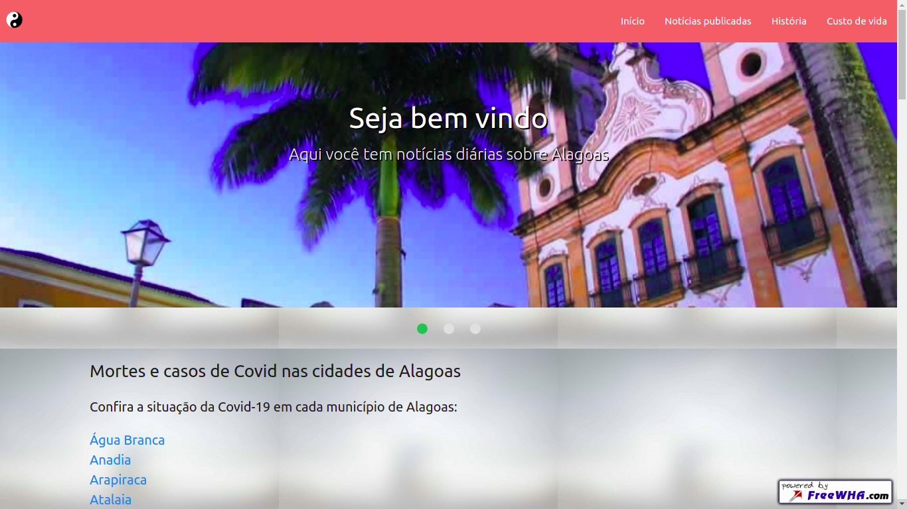
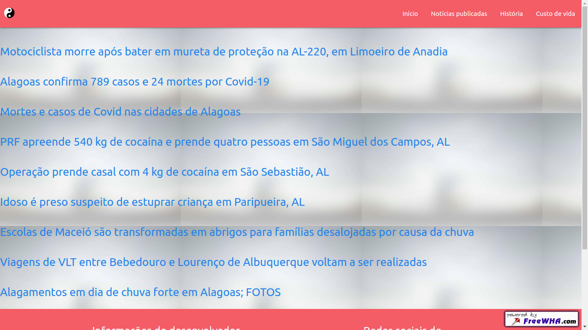
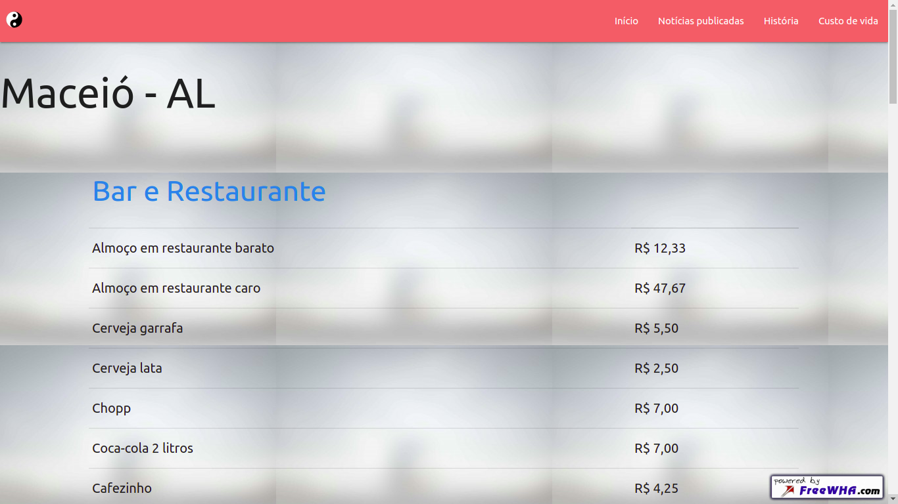
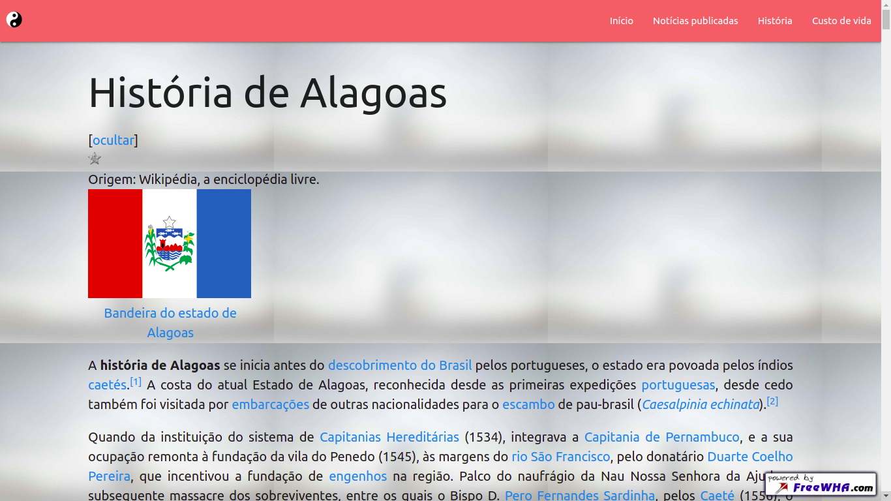

<h1> Alagoas Notícias</h1>

<h3> Descrição </h3>

    Este é um projeto feito em php usando a biblioteca phpQuery para extrair 
    dados e informações de outros sites.

    Esse projeto também faz uso da biblioteca de css/estilos materialize

<h4>Pagina inicial</h4>

<h4>Noticias</h4>

<h4> Custo de vida </h4>

<h4>Historia</h4>

